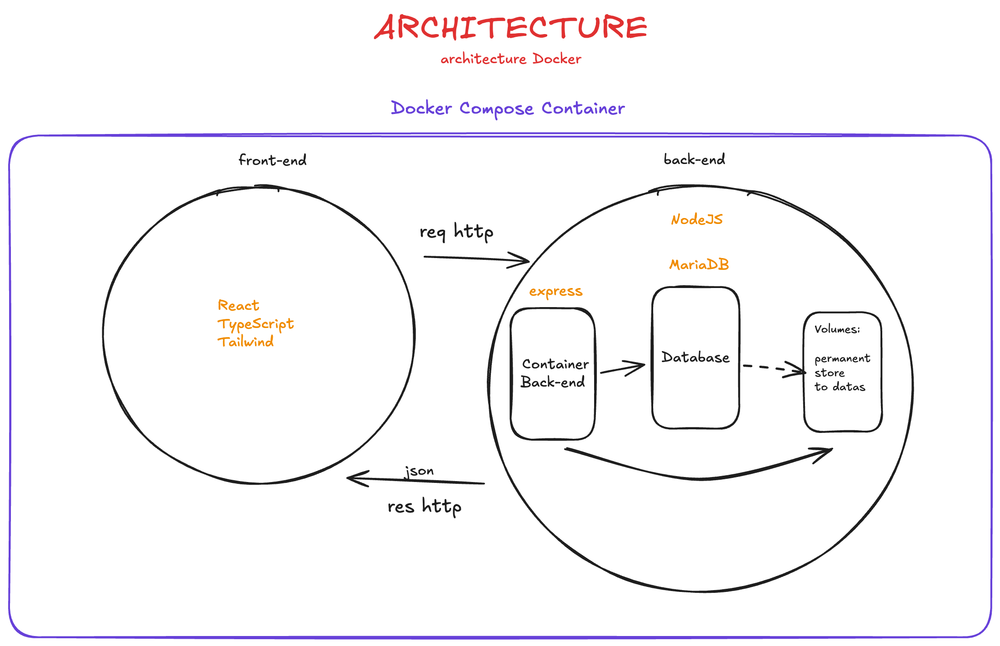
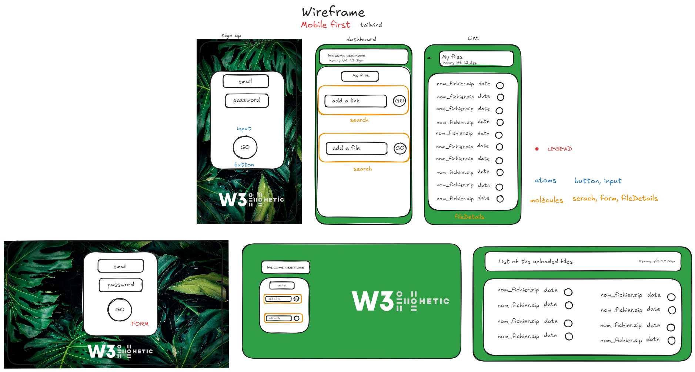

# w3hetic

School project

## Run the project

Clone the project :
`git clone https://github.com/LinelinLove/w3hetic.git`

Copy the file `.env.example` in `w3hetic` folder and rename in `.env`

Copy the file `.env.example` in `w3hetic/app/client/` folder and rename in `.env` and change it if needed (`localhost` or `127.0.0.1` )

### Run with Make command

For those who don't have `make` installed you can get it for
Windows here : `https://gnuwin32.sourceforge.net/packages/make.htm` or with the installer Chocolatey with a few extra step :

- In an Admin Powershell Paste this : `Set-ExecutionPolicy Bypass -Scope Process -Force; [System.Net.ServicePointManager]::SecurityProtocol = [System.Net.ServicePointManager]::SecurityProtocol -bor 3072; iex ((New-Object System.Net.WebClient).DownloadString('https://community.chocolatey.org/install.ps1'))`
- Then this `choco install make`
  Mac OS : `https://formulae.brew.sh/formula/make`

Run the docker-compose file with this command : `make build`

PS: all the command are avaible on the `Makefile`

### Run with Docker compose

`docker compose up --build -d`

Then open your browser on `http://localhost:3001/`

## Notes

All features are not implemented on yet client side but you can test the API REST on `http://localhost:8090/` (or `http://127.0.01:8081/`)

The routes are available on the following path : `app\server\routes`

## Informations

### Architecture of the project

### Wireframe of the project

